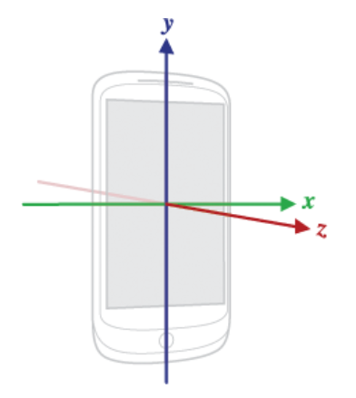

# MAGNETIC COMPASS APPLICATION
## OVERVIEW
* This application is a mimic of a real magnetic compass which tells the direction with respect to the north-south pole of earth using android sensors.  
* You can use this application for all your outdoor activities whether you are flying, sailing or traveling.
*	The sensors used are: Accelerometer and Magnetometer.
*	Accelerometer sensor reports the acceleration of the device along 3 sensor axes. The measured acceleration includes both the physical acceleration (change of velocity) and the gravity. 
*	Magnetometer sensor (also known as magnetic field sensor) reports the ambient magnetic field, as measured along the 3 axes. 
*	To under this application, understanding the orientation of the device is important. Orientation of device can be explained by the Sensor Coordinate System.
*	An orientation sensor (software-based sensor) reports the attitude of the device. The measurements are reported in degrees in the x, y and z fields of sensors_event_t.orientation.

## SENSOR COORDINATE SYSTEM
Sensor coordinate system includes three concepts: Azimuth, Pitch and Roll.
 
 
* AZIMUTH: The angle between the magnetic north direction and the Y axis, around the Z axis (0<=azimuth<360). 
0 = North 
90 = East
180 = South
270 West

*	PITCH: Rotation around X axis (-180<=pitch<=180). This value represents the angle b/w a plane parallel to the device’s screen and a place parallel to the ground.

*	ROLL: Rotation around Y-axis (-90<=roll<=90). This value represents the angle between a plane perpendicular to the device’s screen and a plane perpendicular to the ground.

## TECHNOLOGY STACK

*	Android Studio SDK
*	JAVA 8

